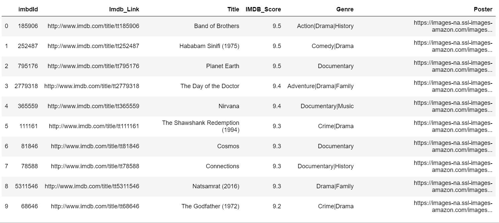

# Using the SQL to create query for Movie Genre data

## Building

```code
python3 -m venv env
source env/bin/activate
pip install -r requirements.txt
```
## Run Notebook

sql_example_notebook.ipynb

## result

** display the top 10 rating movie from the data of [IMDB](https://www.kaggle.com/neha1703/movie-genre-from-its-poster)




